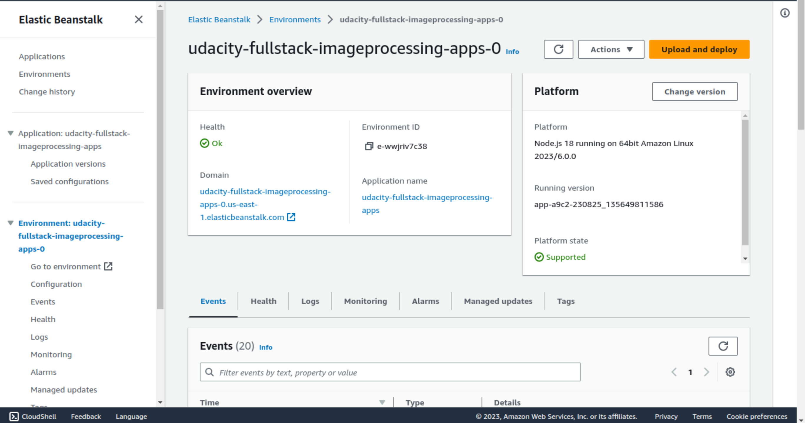

# udacity-fullstack-imageprocessing-apps
This is the Udacity full stack image processing apps on AWS of Tu Dao

# Deployment Snapshot
The following image shows successful deployment of project 2 on AWS cloud.

<p align="center">
  
</p>

Endpoint URL: udacity-fullstack-imageprocessing-apps-0.us-east-1.elasticbeanstalk.com


# How to test?
I exported the Postman collection named "udacity-fullstack-image-processing-app.postman_collection.json" in this repo.
Please open the file by Postman.

A link to the endpoint URL for running EB deployment: udacity-fullstack-imageprocessing-apps-0.us-east-1.elasticbeanstalk.com

# Steps to deploy
Note: 
- Remember to create IAM user on AWS. 
- Store access key (*.csv) file & configure credentials by AWS CLI


```
1. eb init
2. eb create
3. eb deploy # To update 
```
